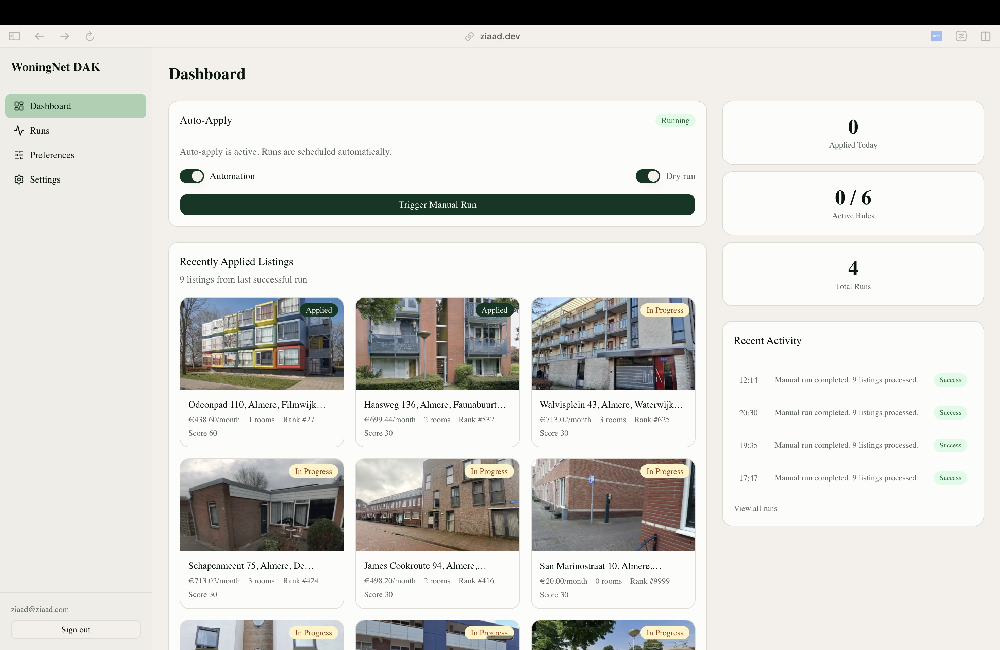
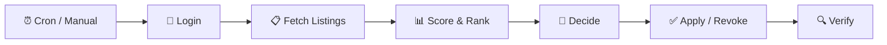
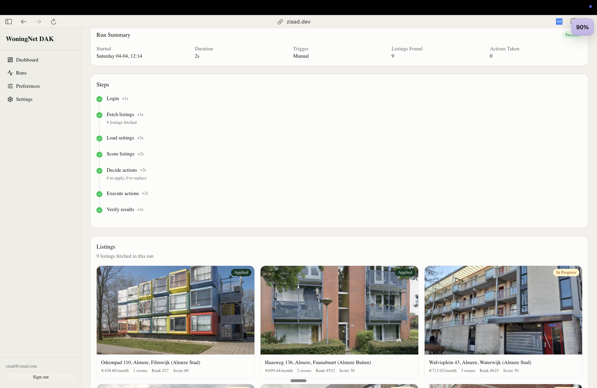
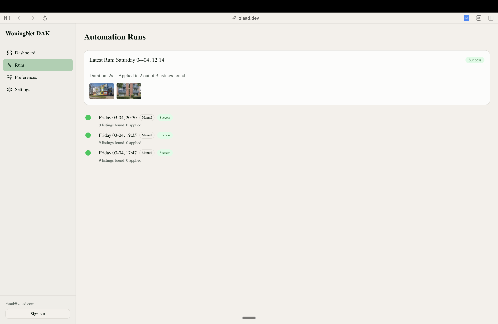
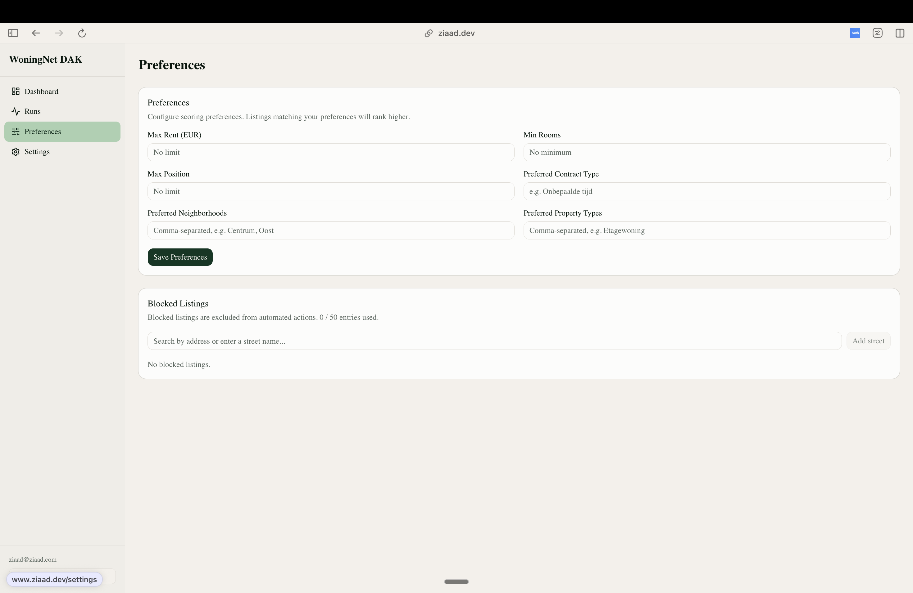

# WoningNet DAK Auto-Apply

Automatically scores, applies to, and manages your social housing applications on [WoningNet DAK](https://almere.mijndak.nl) (Almere).

<p align="center">
  
</p>

## Why

In the Dutch social housing system, you can only hold a limited number of active applications at once. Miss a better listing? Too bad — your slots are full. This app runs on a schedule, scores every available listing against your preferences, and automatically applies to the best ones — revoking weaker applications when something better appears.

## How It Works

Every run executes a full pipeline from login to verification:



Listings are scored 0–100 using weighted rules (queue position, rent, rooms, neighborhood, contract type). The decision engine fills empty slots with top candidates and swaps weaker active applications for better ones.

## Screenshots

| | |
|---|---|
| **Run Detail** | **Run History** |
|  |  |
| **Preferences** | |
|  | |

## Tech Stack

**Next.js 16** · **Supabase** (Postgres, Auth, Edge Functions) · **Deno** · **TypeScript**

## Getting Started

Requires [Docker Desktop](https://www.docker.com/products/docker-desktop/) and [Node.js](https://nodejs.org/) v18+.

```bash
git clone https://github.com/ZiaadNegm/houser.git
cd houser
npm install
supabase start          # starts local Postgres, Auth, Edge Functions
cp .env.local.example .env.local
# fill in ANON_KEY, SERVICE_ROLE_KEY (from supabase start output),
# and CREDENTIAL_ENCRYPTION_KEY (openssl rand -base64 32)
supabase db reset       # apply migrations
```

Run in two terminals:

```bash
supabase functions serve --env-file .env.local   # edge functions
npm run dev                                       # frontend → localhost:3000
```

Register, add your WoningNet credentials in settings, and hit **Trigger Run**.
