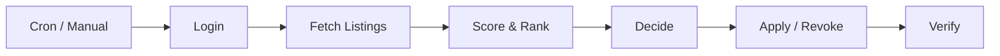

# Houser

Automatically scores, applies to, and manages social housing applications on [WoningNet DAK](https://almere.mijndak.nl) (Almere).

<p align="center">
  
</p>

## Motivation

I built this because I kept missing housing listings while juggling work in the Netherlands. The social housing system here requires constant manual checking, and I was losing out on better apartments simply because I didn't refresh the portal in time. On top of that, you can only hold a limited number of active applications at once, so even when I did check, my slots were often already taken by weaker listings.

I wanted something that would just handle it: check every listing, figure out which ones are worth applying to, and swap out weaker applications when something better shows up.

## How It Works

Every run executes a pipeline from login to verification:



Listings are scored 0-100 using weighted rules (queue position, rent, rooms, neighborhood, contract type). The decision engine fills empty slots with top candidates and swaps weaker active applications for better ones.

## Screenshots

| | |
|---|---|
| **Run Detail** | **Run History** |
|  |  |
| **Preferences** | |
|  | |

## Tech Stack

**Next.js 16** / **Supabase** (Postgres, Auth, Edge Functions) / **Deno** / **TypeScript**

## Getting Started

Requires [Docker Desktop](https://www.docker.com/products/docker-desktop/) and [Node.js](https://nodejs.org/) v18+.

```bash
git clone https://github.com/ZiaadNegm/houser.git
cd houser
npm install
supabase start
cp .env.local.example .env.local
# Fill in ANON_KEY, SERVICE_ROLE_KEY (from supabase start output),
# and CREDENTIAL_ENCRYPTION_KEY (openssl rand -base64 32)
supabase db reset
```

Run in two terminals:

```bash
supabase functions serve --env-file .env.local   # edge functions
npm run dev                                       # frontend at localhost:3000
```

Register, add your WoningNet credentials in settings, and hit **Trigger Run**.
