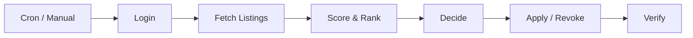

# Houser

Automatically scores, applies to, and manages social housing applications on [WoningNet DAK](https://almere.mijndak.nl) (Almere).

<p align="center">
  
</p>

## The Problem

Social housing in the Netherlands works through a queue system. You register, you wait (often years), and when listings appear you respond to the ones you want. But there's a catch: you can only hold a limited number of active applications at once. Respond to the wrong listing and you've burned a slot. Miss a good one because you were busy at work, and someone with less queue time takes your spot.

I was checking the portal manually between meetings, forgetting to check on weekends, and generally losing out on better apartments because the system rewards constant attention I couldn't give it.

## The Solution

Houser runs on a schedule (twice daily), logs into WoningNet on your behalf, and makes the same decisions you would - just without the forgetting. It scores every available listing against your preferences (rent budget, number of rooms, neighborhoods, contract type) and your queue position. If a new listing scores higher than one of your current applications, it revokes the weaker one and applies to the better option.

The entire pipeline runs as a single pass:



No browser automation, no scraping - just direct HTTP calls to WoningNet's API. Every run is logged with full detail so you can see exactly what happened and why.


Listings are scored 0-100 using weighted rules (queue position, rent, rooms, neighborhood, contract type). The decision engine fills empty slots with top candidates and swaps weaker active applications for better ones.

## Screenshots

| | |
|---|---|
| **Run Detail** | **Run History** |
|  |  |
| **Preferences** | |
|  | |

## Tech Stack

**Next.js 16** / **Supabase** (Postgres, Auth, Edge Functions) / **Deno** / **TypeScript**

## Getting Started

Requires [Docker Desktop](https://www.docker.com/products/docker-desktop/) and [Node.js](https://nodejs.org/) v18+.

```bash
git clone https://github.com/ZiaadNegm/houser.git
cd houser
npm install
supabase start
cp .env.local.example .env.local
# Fill in ANON_KEY, SERVICE_ROLE_KEY (from supabase start output),
# and CREDENTIAL_ENCRYPTION_KEY (openssl rand -base64 32)
supabase db reset
```

Run in two terminals:

```bash
supabase functions serve --env-file .env.local   # edge functions
npm run dev                                       # frontend at localhost:3000
```

Register, add your WoningNet credentials in settings, and hit **Trigger Run**.
